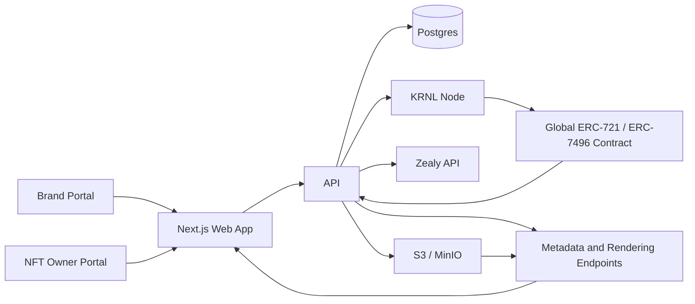

# Dynamic NFT KRNL

Dynamic NFT KRNL is an open-source platform for brand-owned dynamic NFT reward systems powered by Zealy, KRNL workflows, ERC-7496 traits, lootboxes, and composable asset packs.

The platform provides two production-oriented portals:

- **Brand Portal** for creating brands, connecting Zealy communities, syncing quests, managing asset packs, configuring lootboxes, and monitoring workflow runs.
- **NFT Owner Portal** for selecting a brand, viewing XP and LootKeys, opening lootboxes, unlocking traits, activating traits, and viewing the rendered NFT.

Zealy XP is the production source of truth for rewards. Demo mode is included for local evaluation and grants default XP to owner wallets without requiring a live Zealy integration.

## Core Concepts

- **One global NFT contract:** a shared ERC-721 contract serves all brands.
- **ERC-7496 traits:** dynamic trait state is represented through trait keys and values.
- **Off-chain brand resolution:** brand-specific metadata is resolved by the API from token and brand state.
- **Composable rendering:** each NFT is rendered from one base image plus active trait layers in deterministic order.
- **Lootbox progression:** owners spend XP to buy LootKeys, open lootboxes, and unlock off-chain trait choices.
- **KRNL activation path:** setting active traits is the on-chain update path submitted through KRNL workflow templates.

## Architecture



## Repository Layout

```text
apps/
  api/                    Express API, Prisma, KRNL integration, Zealy, metadata, rendering
  web/                    Next.js brand and owner portals

packages/
  contracts/              Solidity contracts, Hardhat config, tests, deployment scripts
  workflows/              KRNL workflow templates and validation scripts

docs/                     Public documentation
scripts/                  Repository verification and validation scripts
.github/workflows/        GitHub Actions sanity workflow
```

## Features

### Brand Portal

- Brand creation and management
- Zealy community connection with `communityId`, API key, and optional webhook secret
- Zealy quest sync
- Asset pack management
- Base image and trait layer upload metadata
- Lootbox configuration
- Weighted trait unlock tables
- Workflow run visibility
- Billing and credit hooks where enabled by the API

### NFT Owner Portal

- Wallet-based login
- Brand selection
- XP and LootKey display
- LootKey purchasing with XP
- Lootbox opening
- Unlocked trait inventory
- Active trait selection
- Rendered NFT preview
- Workflow status visibility for trait activation

### Contracts

- Global ERC-721 dynamic NFT contract
- ERC-7496 interface support
- KRNL-authorized execution support
- Target base authorization primitives
- Hardhat tests and deployment scripts

### Workflows

- Mint base NFT workflow
- Activate traits workflow
- Retained lootbox workflow template
- Retained trait metadata URI workflow template
- JSON validation for workflow structure and executor images

## Requirements

- Node.js 20+
- pnpm 9+
- Docker and Docker Compose
- Postgres
- S3-compatible object storage for uploaded assets
- Privy credentials for wallet login
- Zealy API credentials for production XP
- KRNL node and chain/RPC configuration for live workflow submission

## Quickstart

```sh
pnpm install
cp .env.example .env
docker compose up -d postgres minio
pnpm db:migrate
pnpm dev
```

Default local services:

- Web: `http://localhost:3000`
- API: `http://localhost:8000`
- Postgres: `localhost:5432`
- MinIO API: `http://localhost:9000`
- MinIO console: `http://localhost:9001`

For first local runs, keep `DEMO_MODE=true` in `.env`.

## Environment Configuration

Use `.env.example` as the canonical variable reference. It contains placeholder values only and is grouped by:

- Backend/API
- Frontend/Web
- Contracts

Important variables:

- `DATABASE_URL`
- `NEXT_PUBLIC_API_BASE_URL`
- `DEMO_MODE`
- `GLOBAL_METADATA_BASE_URI`
- `WORKFLOW_TEMPLATES_DIR`
- `S3_ENDPOINT`
- `S3_BUCKET`
- `S3_PUBLIC_BASE_URL`
- `PRIVY_APP_ID`
- `PRIVY_API_KEY`
- `NEXT_PUBLIC_PRIVY_APP_ID`
- `ZEALY_API_BASE_URL`
- `KRNL_NODE_URL`
- `KRNL_SENDER_ADDRESS`
- `KRNL_SENDER_PRIVATE_KEY`
- `SEPOLIA_RPC_URL`

The default workflow template path is internal to this monorepo:

```text
./packages/workflows/workflows
```

Do not point runtime configuration at any external source repository.

## Development Commands

```sh
pnpm dev                 # Run API and web in development mode
pnpm dev:api             # Run API only
pnpm dev:web             # Run web only

pnpm db:migrate          # Run Prisma migrations
pnpm db:generate         # Generate Prisma client

pnpm build               # Build API, web, and contracts
pnpm build:api           # Build API
pnpm build:web           # Build web
pnpm build:contracts     # Compile contracts

pnpm test                # Run API script tests and contract tests
pnpm contracts:test      # Run contract tests
pnpm workflows:validate  # Validate KRNL workflow JSON
pnpm verify:standalone   # Check for forbidden external repo references
```

## Demo Mode

Set:

```env
DEMO_MODE=true
```

Demo mode is designed for local product evaluation:

- Owner wallets receive default XP per selected brand.
- Live Zealy XP is not required to buy LootKeys or open lootboxes.
- Workflow runs may be recorded as queued/submitted without live KRNL submission when supported by the API code path.

Demo mode must not be used as a production authorization or rewards model.

## Asset Packs and Rendering

Asset packs define the visual layer set for a brand:

- One base image
- Trait layer images keyed by `traitName` and `traitValue`
- Active trait selection per owner/token
- Deterministic compositing order

The API resolves brand state, token state, active traits, and asset objects to produce rendered NFT output.

## Lootboxes

Lootboxes define how XP becomes unlockable traits:

- `xpPerLootKey`
- `lootKeysPerOpen`
- `maxUnlocksPerOpen`
- Weighted entries with `traitName`, `traitValue`, and `weight`

Production XP is sourced from Zealy-derived state. Demo mode uses local default XP.

## KRNL Workflows

Workflow templates are stored in:

```text
packages/workflows/workflows
```

The API renders templates with runtime parameters and submits them to the configured KRNL node. Validate templates with:

```sh
pnpm workflows:validate
```

See `packages/workflows/README.md` and `docs/workflows.md` for template details.

## Contracts

Contracts are located in `packages/contracts`.

Compile:

```sh
pnpm contracts:compile
```

Test:

```sh
pnpm contracts:test
```

Deployment requires configured RPC, deployer, owner, master key, recovery key, delegated account implementation, and verification settings. Use placeholder values in `.env.example` only; never commit deployment keys.

## Docker

The root `docker-compose.yml` includes:

- `postgres`
- `minio`
- `api`
- `web`

All build contexts are internal to this repository:

```text
./apps/api
./apps/web
```

## Documentation

Detailed documentation is available in `docs/`:

- `docs/architecture.md`
- `docs/quickstart.md`
- `docs/configuration.md`
- `docs/api.md`
- `docs/brand-portal.md`
- `docs/owner-portal.md`
- `docs/asset-packs-and-rendering.md`
- `docs/lootboxes.md`
- `docs/workflows.md`
- `docs/krnl-integration.md`
- `docs/contracts.md`
- `docs/zealy-integration.md`
- `docs/demo-mode.md`
- `docs/deployment.md`
- `docs/troubleshooting.md`
- `docs/security.md`

## Repository Independence

This repository is intended to be fully standalone.

It must not depend on the original source repositories at runtime, build time, test time, deployment time, or development time. The standalone verifier checks for forbidden references, including external repo paths, local absolute paths, submodules, external Docker contexts, and package dependencies that point outside the repository.

Run:

```sh
pnpm verify:standalone
```

## Security

Never commit:

- `.env` files
- Private keys
- Privy secrets
- Pimlico keys
- Zealy API keys
- JWT verification/signing material
- MinIO or S3 secrets
- Database files
- Uploaded assets
- Logs or local volumes

See `SECURITY.md` and `docs/security.md`.

## CI

The included GitHub Actions workflow runs lightweight repository sanity checks:

- Dependency install
- Workflow validation
- Standalone verification

Build and integration jobs can be expanded once deployment-specific optional dependencies and hosted service requirements are finalized.

## Roadmap

- Production deployment templates for managed Postgres and object storage
- Stronger workflow status reconciliation
- Expanded billing and credit controls
- Rarity and trait analytics
- Additional API contract tests
- Optional end-to-end portal tests

## Contributing

Contributions are welcome. See `CONTRIBUTING.md` for development guidelines.

## License

MIT. See `LICENSE`.
