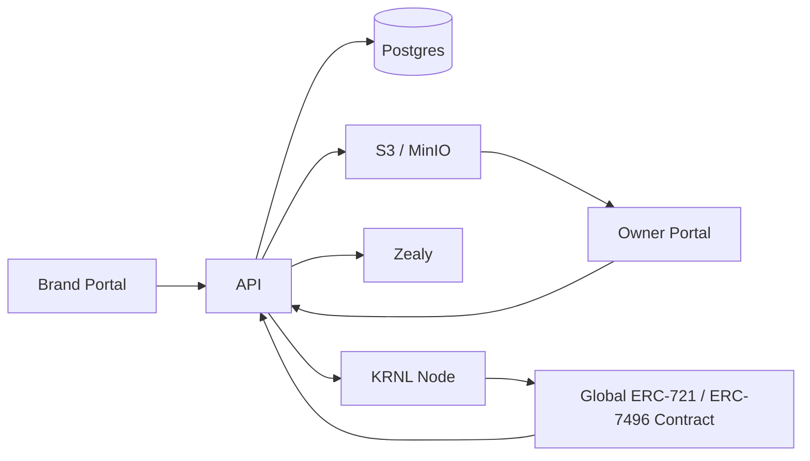

# Dynamic NFT KRNL

Open-source platform for brand-owned dynamic NFT reward systems powered by Zealy, KRNL, ERC-7496 traits, lootboxes, and composable asset packs.

Dynamic NFT KRNL gives brand owners a portal for communities, asset packs, lootbox rules, workflow runs, and billing hooks. NFT owners get a portal for brand selection, XP, LootKeys, lootbox openings, unlocked traits, active trait selection, and rendered NFT previews. Zealy XP is the production source of truth; demo mode provides default XP for local trials.



## What It Does

- Brand portal: create brands, connect Zealy, sync quests, manage asset packs, configure lootboxes, inspect workflows.
- Owner portal: select a brand, view XP and LootKeys, buy keys, open lootboxes, activate unlocked traits.
- Dynamic rendering: deterministic base image plus active trait layers.
- KRNL workflows: templates live in `packages/workflows` and are rendered by the API.
- Smart contracts: global ERC-721 with ERC-7496 trait support in `packages/contracts`.

## Monorepo Structure

```text
apps/api                 Express, Prisma, KRNL, Zealy, storage, metadata
apps/web                 Next.js brand and owner portals
packages/contracts       Solidity contracts, Hardhat scripts, tests
packages/workflows       KRNL workflow templates and validator
docs                     Public project documentation
scripts                  Repository validation helpers
```

## Quickstart

```sh
pnpm install
cp .env.example .env
docker compose up -d postgres minio
pnpm db:migrate
pnpm dev
```

The web app runs at `http://localhost:3000`; the API defaults to `http://localhost:8000`.

## Demo Mode

Set `DEMO_MODE=true` for local demos. Owner wallets receive default XP per selected brand, live Zealy XP is not required for buying keys or opening lootboxes, and KRNL submission can be recorded without a live node where the current API supports that bypass.

## Environment Setup

Use `.env.example` as the canonical variable list. Keep `WORKFLOW_TEMPLATES_DIR=./packages/workflows/workflows` unless you intentionally override it with another path inside this repository.

## Commands

```sh
pnpm dev
pnpm build
pnpm test
pnpm contracts:compile
pnpm contracts:test
pnpm workflows:validate
pnpm verify:standalone
```

## Deploying Contracts

Configure `DEPLOYER_PRIVATE_KEY`, `SEPOLIA_RPC_URL`, `ETHERSCAN_API_KEY`, `MASTER_KEY`, `RECOVERY_KEY`, `OWNER_ADDRESS`, and `DELEGATED_ACCOUNT_IMPL`, then run package deploy scripts from `packages/contracts`.

## Workflow Templates

KRNL templates are stored in `packages/workflows/workflows`. The API defaults to that internal path and may be overridden with `WORKFLOW_TEMPLATES_DIR`.

## Security Notes

Do not commit `.env` files, private keys, Privy secrets, Pimlico keys, Zealy API keys, MinIO credentials, JWT keys, or generated uploads. Demo mode is not a production security model.

## Roadmap

- Harden production billing and rate limits.
- Expand workflow status reconciliation.
- Add richer trait rarity analytics.
- Add deployment examples for managed Postgres and object storage.

## Contributing

See `CONTRIBUTING.md`.

## License

MIT.
